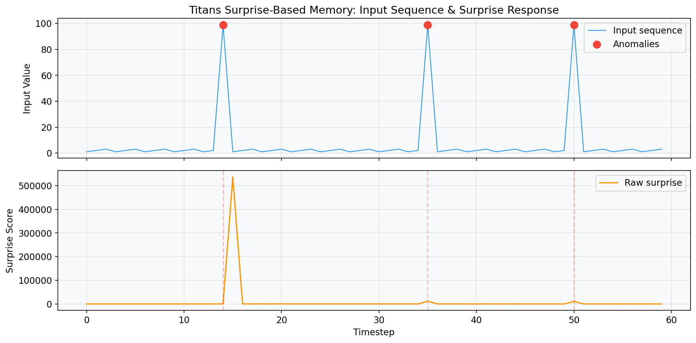
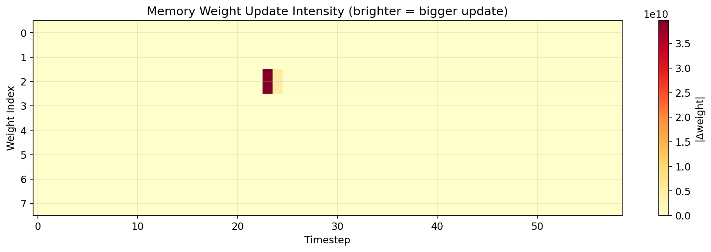
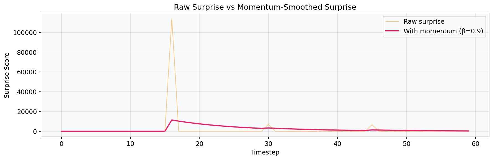
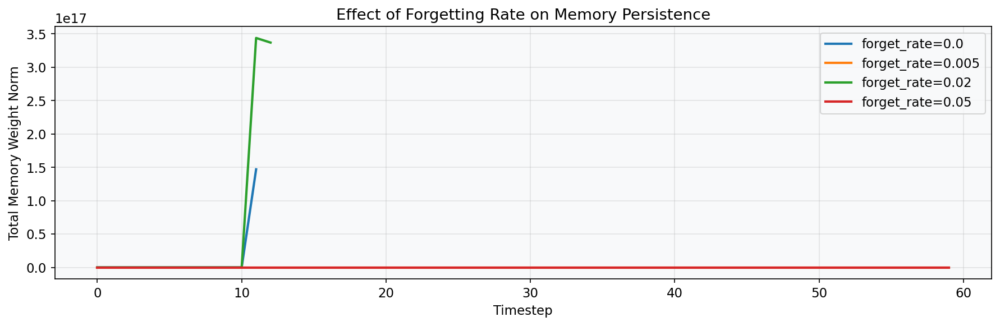
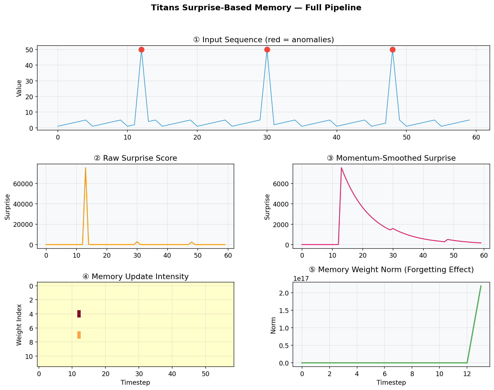

# Titans MIRAs Demo

Demo mo phong co che **Surprise-Based Memory** tu kien truc [Titans](https://research.google/blog/titans-miras-helping-ai-have-long-term-memory/) cua Google Research, su dung Python va PyTorch.

## Titans hoat dong nhu the nao?

Titans su dung **mang MLP nho** lam bo nho dai han. Thay vi luu tat ca thong tin, no chi ghi nho nhung gi **bat ngo**:

```
Moi timestep:
  1. Tinh surprise (du lieu nay co bat ngo khong?)
  2. Doc bo nho (memory du doan gi?)
  3. Ghi bo nho gated by surprise (chi ghi neu moi la)
  4. Cap nhat surprise predictor (hoc pattern)
  5. Ap dung forgetting (quen thong tin cu)
```

**3 co che chinh:**
- **Surprise Metric** — Do "do bat ngo" = sai so du doan (MSE)
- **Surprise-Gated Writes** — Chi ghi nho khi surprise cao
- **Adaptive Forgetting** — Tu dong quen thong tin cu qua weight decay

## Demo Figures

### Surprise Score theo thoi gian


### Memory Update Heatmap


### Raw Surprise vs Momentum


### Hieu ung Forgetting


### Full Pipeline Dashboard


## Cau truc Project

```
titans-miras-demo/
├── titans_memory/              # Python package
│   ├── surprise.py             # SurpriseMetric (do do bat ngo)
│   ├── memory.py               # MemoryModule (MLP lam bo nho)
│   ├── titans.py               # TitansMemoryLayer (ket hop tat ca)
│   └── data.py                 # Tao du lieu tong hop
├── scripts/
│   └── generate_figures.py     # Xuat tat ca anh PNG
├── notebooks/
│   ├── 01_surprise_metric.ipynb
│   ├── 02_memory_module.ipynb
│   ├── 03_full_titans.ipynb
│   └── 04_visualization.ipynb
├── tests/                      # 12 tests
└── figures/                    # Anh demo
```

## Cai dat

```bash
# Clone repo
git clone https://github.com/kinhluan/titans-miras-demo.git
cd titans-miras-demo

# Cai dependencies (can uv - https://docs.astral.sh/uv/)
uv sync --extra dev
```

## Su dung

```bash
# Chay tests
uv run pytest tests/ -v

# Tao tat ca anh demo
uv run python scripts/generate_figures.py

# Mo notebooks
uv run jupyter notebook notebooks/
```

## Notebooks

| Notebook | Noi dung | Visualization |
|----------|----------|---------------|
| `01_surprise_metric` | Giai thich surprise metric | Line chart surprise scores |
| `02_memory_module` | MLP memory + forgetting | Bar chart + decay curves |
| `03_full_titans` | Full TitansMemoryLayer | 3-panel + hyperparameter comparison |
| `04_visualization` | 4 scenarios tong hop | Dashboards + grid comparisons |

## Dependencies

- Python >= 3.11
- PyTorch >= 2.0
- matplotlib >= 3.7
- numpy >= 1.24
- Jupyter >= 1.0

## Tham khao

- [Titans + MIRAs: Helping AI Have Long-Term Memory](https://research.google/blog/titans-miras-helping-ai-have-long-term-memory/) — Google Research Blog
